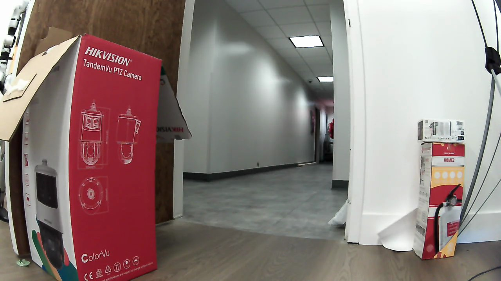
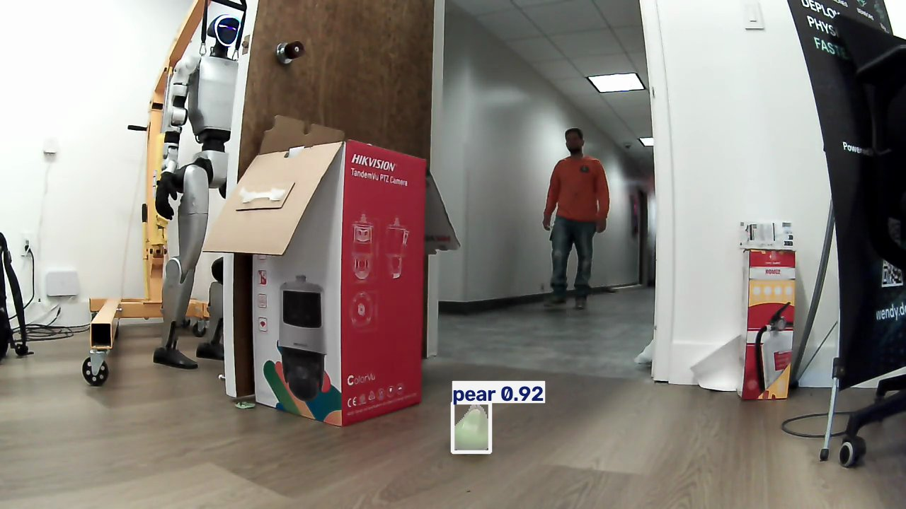
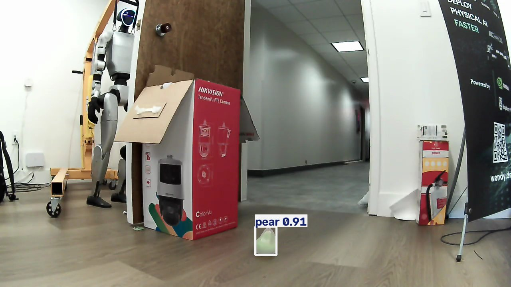
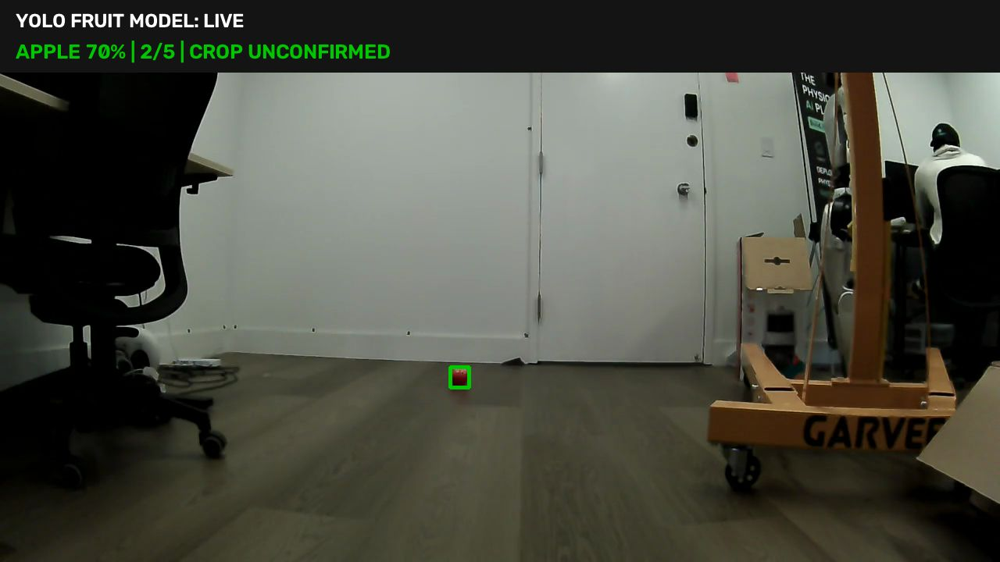

# Validation results

No live motion behavior has been validated in this repository yet. The
read-only measurements below are the first live camera and pear-recognition
evidence captured by this repository.

Automated checks establish that the state model is deterministic, Remote
Takeover is process-latched, activation is recorder-backed, and production code
does not import the legacy project. They do not qualify physical motion or the
autonomous routine.

## V22-BLACK-BOX-DEPLOY-2026-08-11 — deployed and ready, no motion

- Direct whole-project Stagefile deployment completed with
  `wendy run --detach`; Docker Layer Optimizer was not used.
- The first two build attempts failed before device replacement because the
  dedicated `wendy-mtls` BuildKit filesystem had reached 100% usage. Truncated
  Ubuntu `InRelease` downloads surfaced misleadingly as invalid-signature
  errors. Removing only unused Wendy builder cache and unused local Border
  Collie media images restored 36.8 GB of build-host free space.
- The successful deployment installed matching app and media identity
  `stage-camera-v22-black-box`, configuration schema 6. The app exposed the
  per-run trace route, and media reached ready with zero restarts.
- Three post-deploy media samples advanced source PTS from `3780` to `8100` to
  `12480` on one stable generation. Bark and the banana specialist were ready.
- Final safety state: mission idle, no active run or recovery, no Remote
  Takeover, no active hardware operation, guardian inactive, motion disarmed,
  and last command exactly zero.
- The seeded, balanced random fruit order and per-run A/B/C search-policy
  selector are unchanged. No physical run was activated, so this validates
  deployment/readiness and not search-policy performance.

## HOME-RETURN-DIAGNOSIS-2026-08-11 — failed safely, cause isolated

- Physical run `7098b433-23db-4c2d-9811-59dd8d2019c5` completed fruit search,
  approach, Arrival, and the action sequence, then failed return with
  `return Home stalled 0.323 m from its active waypoint` and disarmed.
- The aggregate's `1.8595 m` terminal Home value is stale: failed
  `return_home` produced no stage result, so summary fallback selected the last
  completed `turn_toward_home` stage measured before return translation.
- Failed-run recovery began with raw Go2 Home distance `0.3258 m` and filtered
  distance `0.3250 m` (`0.0244 m` position sigma). Their agreement does not
  support a one-metre odometry jump.
- Recovery rebuilt the entire reversed outbound breadcrumb list. Although Woof
  was already about `0.325 m` from Home, its active target became an old
  fruit-side breadcrumb; the resulting `1.574 m` error was distance to that
  stale waypoint, not distance to Home.
- The original return then recovery both entered yaw-only correction at
  `0.30 rad/s`, which is at the observed factory-avoidance posture-only edge.
  This is a contributing control failure, separate from localization.
- Operational consequence: do not use the aggregate fallback value or an
  active-waypoint error as current Home distance. Preserve the latest raw and
  fused Home pose, target kind, and planner decision in the per-run black-box
  trace. Resume recovery from current pose toward Home; never replay a consumed
  outbound route from its beginning.

Evidence: `benchmarks/results/search-fast-lock.json`.

## PRODUCTION-OFFLINE-001 — passed

- Observed: 2026-08-03 in the clean repository
- Scope: 70 automated tests plus Ruff and Python bytecode compilation
- Complete-run boundary: production runtime wiring, all eight stage dispatches,
  durable Run Results, terminal Home measurements, and diagnostic stage status
- Motion replays: measured half-turn, bounded pear search, geometry-gated
  approach, one 1.0 m/s by 0.40 s lower-edge final push, posture actions,
  odometry return to 0.10 m, and heading restoration to 5 degrees
- Camera safety: generation/source-marker binding, 0.350 s source gap reset,
  frozen-source failure, and camera health rechecked during the final push
- Media boundary: one read-only WebRTC owner provides pear evidence and bark;
  it imports no motion client
- Result: passed the local implementation gate
- Limitation: deterministic adapters and recorded hardware facts do not qualify
  the combined physical sequence. The next step remains a direct Stagefile
  deployment with `wendy run`, then one supervised Woof end-to-end acceptance
  run.

## PREFLIGHT-FAIL-CLOSED-001 — passed

- Observed: 2026-08-03 at 11:15 PDT on the clean app at
  `http://127.0.0.1:8110/`
- Safety: hardware and lab motion disabled; no clients initialized and no
  physical motion command sent
- Activation: pear Demo Run `58c116e4-bb31-4a90-a21e-d25c4f6b3b31` was
  durably created before readiness evaluation
- Checks: durable storage and motion-disarmed passed; hardware connection,
  fresh pose, and production camera/perception readiness failed
- Terminal result: `FAILED / PREFLIGHT_FAILURE`, failed phase `preflight`, and
  final safety state `DISARMED_CONFIRMED`
- Audience UI: retained the failed Run ID and message and immediately made
  **Activate Demo** available for a new run
- Result: passed the fail-closed preflight rule; missing readiness cannot leave
  a run hanging or advance to Home capture
- Limitation: the all-ready path is integration-tested through qualified
  hardware and camera boundaries, but it has not been exercised on Woof and no
  production camera adapter is connected yet

Evidence: `lab/current-activation/results/PREFLIGHT-FAIL-CLOSED-001.json`.

## ACTIVATE-RECORDER-001 — passed

- Observed: 2026-08-03 at 11:04 PDT on the clean app at
  `http://127.0.0.1:8110/`
- Safety: hardware and lab motion disabled; no clients initialized and no
  physical motion command sent
- Audience surface: **Activate Demo** was enabled before the run, disabled while
  it was active, and enabled again after Stop
- Activation: created Demo Run
  `196ddbfc-57b2-49b0-9f98-3c6ac2a68935` for pear and visibly entered
  `preflight`
- Persistence: append-only `events.ndjson` and atomically materialized
  `result.json` were present; the result was readable by its full UUID
- Stop: the same run sealed as `STOPPED` with reason `OPERATOR_STOP`, final
  safety state `DISARMED_CONFIRMED`, and ordered `idle -> preflight -> stopped`
  events
- Result: passed the recorder-backed activation and operator-stop lifecycle
- Limitation: autonomous orchestration is not connected, so activation
  intentionally stops at `preflight`; this is not an end-to-end demo pass

Evidence: `lab/current-activation/results/ACTIVATE-RECORDER-001.json`.

## ACTIVATE-CURRENT-001 — blocked by design

- Observed: 2026-08-03 at 10:44 PDT on the clean app at
  `http://127.0.0.1:8110/`
- Safety: hardware and lab motion disabled; no clients initialized and no
  physical motion command sent
- Audience surface: **Activate Demo** was visible and disabled with the message
  that autonomous activation is not enabled
- Activation API: `POST /api/run` returned HTTP 404 and created no Demo Run
- Stop path: the visible **Stop** control moved the mission scaffold to
  `stopped` with zero stop errors
- Result: the current clean build cannot run the end-to-end demo yet. This is an
  expected fail-closed state, not an application crash and not a completed
  hardware test.
- Missing activation dependencies: durable Run Result recorder and APIs,
  production camera/perception adapter, autonomous phase orchestrator, qualified
  fruit approach/actions, and qualified return-to-Home control.

Evidence: `lab/current-activation/results/ACTIVATE-CURRENT-001.json`.

## Reused evidence boundary

The factory-avoidance motion implementation is adapted from the previous
prototype, where 0.50 m/s for a bounded 0.40-second pulse produced visible
movement and finished disarmed with zero velocity. That evidence justifies the
initial value and adapter choice; it does not count as validation of this new
build. The first deployment must repeat the guarded acceptance in
`lab/motion/README.md`.

The first combined clean-repository run later showed that operating continuously
at the exact 0.50 m/s deadband edge did not produce visible translation during
the approach. The production approach now requests the separately observed
1.0 m/s factory-avoidance signal while retaining continuous camera steering,
the 20-second timeout, lower-edge arrival evidence, and automatic disarm. This
change is an evidence-based correction, not a new physical qualification; the
next supervised run must confirm the approach actually advances.

## APPROACH-MOTION-001 — observed movement, intentionally stopped

- Observed: 2026-08-03 on Woof, Demo Run
  `a0258967-eb4d-4710-803d-858aa105b882`
- The operator confirmed that the revised 1.0 m/s factory-avoidance approach
  produced physical forward movement toward the pear.
- The operator stopped the run during `approach_fruit`; the terminal result is
  `STOPPED / OPERATOR_STOP`, motion is disarmed, the factory-avoidance remote
  owner is released, and the final command is zero.
- This qualifies the movement-input correction only as an observation. It does
  not complete Arrival, the off-screen final push, lie-down/bark, stand-up,
  pulse-count return, or the Home gates, so no completed-test snapshot is
  attached.

## ARRIVAL-ACTION-001 — completed stages, corrections required

- Observed: 2026-08-03 on Woof, Demo Run
  `f21054c5-598f-4008-a024-27f7b5e2d971`
- Arrival completed with 8 recorded forward heartbeats and the 0.4-second
  final push, but the operator reported that Woof remained too far from the
  pear.
- The pear was not required to be centered before the first forward command.
- `sit_and_bark` completed in 0.204 seconds and `stand` began approximately
  7 ms later. This confirms that the asynchronous StandDown action had no
  visible hold before StandUp interrupted it.
- The subsequent Home turn failed safely after the 0.30 rad/s, 15-second
  envelope timed out. The Run Result sealed as
  `FAILED / RETURN_HOME_FAILURE`; motion released and remained disarmed.
- Prepared corrections: three fresh center confirmations within the middle
  16% of the frame before translation, a 1.0 m/s by 1.0-second final push, a
  5-second down hold, and the already-working 0.50 rad/s by 30-second bounded
  turn input for the Home turn.
- This test is not marked passed and has no completed-test snapshot. The
  corrected sequence requires a new supervised run.

## APPROACH-CENTER-001 — failed, safely disarmed

- Observed: 2026-08-03 on Woof, Demo Run
  `2dd2ea43-8c5f-4a25-8698-54aa48fd31ad`
- The turn and find stages completed with fresh pear evidence, including 12
  stable detections in `find_fruit`, but `approach_fruit` timed out after its
  full 20-second envelope without recording Arrival.
- The operator observed that the initial centering correction was too small to
  produce a useful physical turn. The prior proportional controller requested
  only about 0.24–0.30 rad/s near the edge of the center gate and continued
  sending smaller yaw values while collecting centered confirmations.
- The Run Result sealed as `FAILED / ARRIVAL_FAILURE`; motion released, the
  factory-avoidance remote owner cleared, and the final command was zero.
- Prepared correction: outside the center band use a fixed 0.50 rad/s yaw—the
  signal already observed to turn Woof—and inside the band command exactly
  zero yaw while collecting three confirmations.
- This test is not marked passed and has no completed-test snapshot. The
  corrected centering behavior requires a new supervised run.

## FINAL-APPROACH-SPEED-001 — correction prepared

- Observed: 2026-08-04 during a supervised Woof Demo Run
- The operator confirmed that the overall sequence worked, but the 1.0 m/s by
  1.0-second movement after qualified lower-edge pear disappearance was too
  fast.
- Prepared correction: retain the 1.0 m/s camera-guided approach, reduce only
  the single bounded off-screen movement to 0.3 m/s, release motion, and keep
  the existing explicit stop before lie-down.
- This correction is covered by automated configuration tests but remains a
  physical qualification candidate until the next supervised run.

## CAMERA-SOURCE-001 — passed

- Observed: 2026-08-03 at 09:43 PDT on `woof.local`
- Safety: read-only WebRTC video; no motion client imported and no motion
  command sent
- Sample: 430 decoded 1280×720 frames over 32.411 seconds
- Source identity: PTS and time base present on every frame; zero repeated or
  regressed PTS values; stable `1/90000` time base
- Content continuity: zero identical consecutive luma frames
- Callback cadence: mean 0.070134 s, p95 0.089104 s, max 0.146180 s
- Result: decoded-frame PTS is suitable as a strictly advancing identity marker
  for this camera connection
- Limitation: the calculated PTS delta was 0.000667 s while callback cadence
  averaged 0.070134 s, so PTS must not be treated as a wall-clock age or cadence
  measurement. This run did not validate reconnect generations, stale-frame
  thresholds, pear confidence, or detection stability.

Evidence: `lab/camera-source/results/CAMERA-SOURCE-001.json` and
`lab/camera-source/results/CAMERA-SOURCE-001.jpg`.

## PEAR-EVIDENCE-001 — passed

- Observed: 2026-08-03 at 16:52 PDT on `woof.local`
- Safety: read-only WebRTC video and GPU inference; no motion client imported
  and no motion command sent
- Sample: 858 decoded frames over 63.106 seconds; 727 inference samples were
  eligible for recognition scoring
- Recognition: 727/727 pear matches (100%); zero misses and zero consecutive
  misses
- Confidence: mean 0.870628, minimum 0.811677, p95 0.901923, maximum 0.922483
- Inference time: mean 0.071854 s, p95 0.081585 s; one 4.637798 s startup
  outlier
- Detection age: mean 0.091424 s, p95 0.122844 s; one 4.645201 s startup
  outlier
- Camera identity: zero missing, repeated, or regressed PTS values; zero
  identical consecutive luma frames
- Result: passed the provisional acceptance rule of at least 30 eligible
  samples and at least 80% pear matches. The saved annotated frame visually
  confirms that the detection is on the pear.
- Limitation: this run did not interrupt or reconnect the camera and therefore
  does not validate reconnect recovery or a production stale-frame envelope.

Evidence: `lab/pear-evidence/results/PEAR-EVIDENCE-001.json` and
`lab/pear-evidence/results/PEAR-EVIDENCE-001.jpg`.

## CAMERA-RECONNECT-001 — passed

- Observed: 2026-08-03 at 17:04 PDT on `woof.local`
- Safety: read-only WebRTC video and GPU inference; no motion client imported
  and no motion command sent
- Method: qualify a baseline generation, deliberately close that client camera
  connection, hold it offline for 2.009 seconds, create a distinct replacement
  generation, and require the full pear preflight again
- Baseline: 117 decoded frames; 32/32 pear matches; strictly advancing PTS and
  stable `1/90000` time base
- Replacement: first decoded frame arrived 4.409 seconds after the planned
  disconnect; first pear match arrived approximately 4.499 seconds after the
  disconnect; full 30-sample preflight passed after 6.677 seconds
- Replacement evidence: 34 decoded frames; 32/32 pear matches; mean confidence
  0.889068; strictly advancing PTS and stable `1/90000` time base
- Generation boundary: the two opaque generations were distinct; the first
  replacement detection was bound to the replacement generation and its exact
  PTS/time base; the prior run was not resumed
- Startup behavior: the decoder logged transient missing-PPS/H.264 errors before
  baseline frames became available, then recovered without a recorded camera
  error. The replacement generation did not exhibit a measured evidence stall.
- Result: passed clean client disconnect/reconnect and fresh replacement
  preflight. A production Demo Run must still terminate the original run and
  log `CAMERA_FAILURE`; only a newly started run may use replacement evidence.
- Limitation: this did not simulate packet loss, a robot-side camera crash, or
  an application restart, and it does not yet prove the Demo Run's terminal
  `CAMERA_FAILURE` record implementation.

Evidence: `lab/camera-reconnect/results/CAMERA-RECONNECT-001.json` and
`lab/camera-reconnect/results/CAMERA-RECONNECT-001.jpg`.

## DISTANT-PEAR-DIAGNOSTICS — deployed and reproduced on hardware

- A failed healthy-camera search is now classified separately as
  `TARGET_RECOGNITION_FAILURE`, not motion or camera failure.
- The Run Result retains search sample count, pear-candidate count, strongest
  confidence, largest box-area ratio, closest candidate, and sweep progress.
- The media process maintains a bounded approximately 20-second raw-frame
  sequence and an annotated terminal comparison. The app persists both before
  sealing an orchestrated terminal result and `/debug` links the files.
- Raw frames are compatible with manual upload to Fieldmark and the live raw
  endpoint can be configured as Fieldmark's Go2 source. The reusable local run
  labeler opens an archive directly and exports corrected normalized boxes.
- Automated contract tests pass for capture, rolling bounds, persistence,
  download authorization, and distinct failure classification.

Hardware run `f9de499a-014f-460c-9748-c2c875a85f27` reproduced the distant-pear
failure on 2026-08-04. The camera remained healthy and the model retained a
centered pear box, but `approach_fruit` stopped and timed out because the same
0.65 acquisition threshold was being reused for tracking. Its 40-frame archive
contains pear confidence from 0.518 to 0.686 (median 0.612): only 5 frames met
the acquisition threshold while 33 met 0.55. A focused regression test now
locks acquisition at 0.65 while permitting an already-acquired approach track
after three consecutive fresh detections at or above 0.55. The back-to-back
physical runs below exercised this tracking path successfully.

### Crop-and-confirm — deployed and exercised on hardware

- The existing TensorRT engine now performs at most one conditional crop pass
  for a small or uncertain full-frame pear proposal. Promotion requires higher
  confidence and at least 0.10 IoU with the original box.
- Replaying the trigger rules over all 40 frames from run
  `f9de499a-014f-460c-9748-c2c875a85f27` selects a 256×256 confirmation crop for
  every frame. Those boxes occupied only 0.12–0.14% of the full image.
- Recorded single-pass inference had a 0.060-second median and 0.076-second
  maximum. After deployment, 20 distinct live two-pass frames measured from
  0.115 to 0.137 seconds, below the unchanged 0.200-second deadline.
- Automated tests prove the second pass is bounded to one, maps crop boxes back
  to full-frame coordinates, rejects a high-confidence spatial disagreement,
  avoids extra work for large confident detections and extremely weak noise,
  and preserves crop diagnostics through the mission adapter.
- Search now responds to a 0.50+ full-frame crop candidate with a 50% duty
  cycle: it alternates the already validated yaw magnitude with zero instead of
  sending an unreliable weaker turn command. An unqualified enlarged result
  continues the bounded rotation; only the existing 0.65-by-five acquisition
  gate stops it. Automated motion tests lock the hold/turn sequence and its Run
  Result counters.

Three back-to-back supervised Demo Runs were recorded after deployment. Every
run completed `return_home` inside the 0.10-meter Home gate, at approximately
0.078, 0.065, and 0.063 meters. Runs
`6a613766-47d1-49f0-820b-bf1ba0a0c9cc` and
`da32e0c7-f642-464e-a166-9e6d6c76ef86` completed end to end in 50.47 and 38.61
seconds. Their terminal Home distances were approximately 0.085 and 0.048
meters. The remaining run reached Home at approximately 0.065 meters and then
failed safely in `restore_heading` when a yaw command produced insufficient
measured response; its final safety state was `DISARMED_CONFIRMED`.

The completed 50.47-second run recorded 18 crop-candidate search samples, 10
zero-yaw slowdown holds, and 7 reliable-rate slowdown turns before stable pear
acquisition. The completed 38.61-second run recorded 7 crop-candidate samples,
4 holds, and 2 slowdown turns. These results validate the new candidate
slowdown and the return-to-Home position behavior while preserving the final
heading-restoration no-response failure as a known follow-up.

## RED-APPLE-001 — passed read-only recognition

- Observed: 2026-08-04 on `woof.local`
- Safety: camera-only fruit-test surface; motion remained locked, disarmed, and
  inactive
- Recognition: the full-frame model placed the apple box on the red apple and
  reached 15 consecutive qualifying detections, exceeding the provisional
  0.70-confidence-by-five rule
- Confidence window: 20 samples, mean 0.699, minimum 0.667, maximum 0.740; 9 of
  20 sampled statuses were at or above 0.70
- Crop behavior: the optional crop pass remained unconfirmed and was not needed
  for qualification; the full-frame result supplied the qualifying evidence
- Result: passed the apple recognition gate and was promoted into the shared
  Qualified Fruit list for supervised Demo Runs
- Operating-envelope restriction: `apple` means the tested red apple; the
  failed green-apple trial is not qualified
- Limitation: the fruit-neutral motion path is enabled for supervised red-apple
  trials, but a red-apple end-to-end run has not yet been recorded

Evidence: `lab/fruit-recognition/results/RED-APPLE-001.json` and
`lab/fruit-recognition/results/RED-APPLE-001.jpg`.

## VOICE-DEMO-V1 — working checkpoint

- Recorded: 2026-08-05 from supervised operator validation on `woof.local`.
- Voice activation: a recognized supported fruit request reaches the same
  narrow Demo Run API as the audience control and does not bypass readiness or
  motion gates.
- Fruit already in view: fresh qualified evidence conditionally skips the
  initial turn/search stages and proceeds to approach centering.
- Fruit not initially in view: Woof performs the bounded camera-guided search,
  acquires the Target Fruit, and then enters the same approach path.
- Checkpoint meaning: this is the first working voice-triggered demo version
  with both initial-visibility paths. It is not a new general Operating
  Envelope or a claim of precise final pose.

Known motion-quality follow-ups:

- **Return to Home precision:** Woof returns approximately to Home, but may
  finish slightly over- or undershot and may retain a small heading error.
- **Fruit approach precision:** the final distance varies between runs and can
  place Woof too close to or too far from the fruit.
- These are calibration and closed-loop-control priorities for the next
  checkpoint. Existing camera, timeout, disarm, and bounded-motion failures
  remain fail-closed while that work is underway.

## BASE-BRANCH-CONFIRMATION-2026-08-08 — passed

- Observed: 2026-08-08, three consecutive supervised pear Demo Runs on Woof
- Build: `demo/base` at `648469f`, deployed with build label `base (demo/base)`
- Results: 3/3 `COMPLETED / SUCCESS`; terminal Home distances 0.0756, 0.0274,
  and 0.0578 m against the 0.10 m gate; heading errors 3.1, -4.3, and -1.7
  degrees against the 5-degree gate; durations 41.4, 40.4, and 40.2 s
- Coverage: run one skipped search (fruit already visible); runs two and three
  exercised `turn_to_fruit` before approach. All runs ended
  `DISARMED_CONFIRMED`
- Meaning: this configuration reproduces its 2026-08-05 record
  (0.063–0.078 m) on a different day, so `demo/base` is selected as the robust
  base branch. It also exonerates the environment for the 2026-08-07
  supervised failures (0.187–0.375 m): those ran the arrival-rework commits,
  which remain quarantined off this branch pending their own supervised pass
- Operator observation: the approach sometimes finishes too close to the
  fruit. This remains the "Fruit approach precision" follow-up above — a
  refinement item, not a gate failure. Any approach-distance tuning must
  revalidate against `benchmarks/results/supervised-three-run-2026-08-08.json`

Evidence: `benchmarks/results/supervised-three-run-2026-08-08.json`.

## STAGE-CAMERA-V15-PEAR-RUN-2026-08-11 — failed at heading restoration

- Run: `7b5cfd93-7359-4f4c-908e-9b791e0bde93`
- Build: `codex/stage-camera-three-fruit` at `c6f70eb`, deployed with runtime
  label `stage-camera-v15-base-compatible-arrival`
- Deployment: complete root and media Stagefiles through `wendy run --detach`;
  134.524 seconds; matching app/media release identities; readiness and disarm
  verified before activation
- Approach: pear acquired and centered; 25 qualified close-range samples; no
  discontinuity or stale-frame stop; confidence-collapse Arrival with filtered
  center `0.4818`; exactly one configured final-push episode at `0.6 m/s` for
  `1.0 s`
- Audience action: Arrival, stand-down, bark, five-second hold, and stand-up all
  completed
- Return translation: all seven breadcrumb targets reached; return stage
  stopped at `0.07946 m`, inside the `0.10 m` Home gate
- Failure: heading restoration then moved the measured Home distance to
  `0.124 m`, producing `RETURN_HOME_FAILURE` in `restore_heading`
- Safety: `DISARMED_CONFIRMED`, no active run or recovery, zero released motion
  command, and 73% battery after the run
- Evidence: bounded flight-recorder, evidence archive, and terminal frame were
  retained. Telemetry proves the control sequence but does not establish the
  physical fruit clearance; that remains an operator-observation field.

Meaning: the stage-camera change repaired the previously failing fruit-facing
path for this run. The current blocker moved to the Home-heading contract:
heading restoration must preserve the already-achieved position gate rather
than rotating until translation drifts outside it. One run is not repeatability
evidence, and this checkpoint is not qualified.

Compact evidence: `benchmarks/results/stage-camera-v15-pear-run-2026-08-11.json`.

## STAGE-CAMERA-V15-PEAR-RUN-2-2026-08-11 — Arrival timed out

- Run: `bce852b0-8645-46b4-9d26-dedcb6cb81a4`
- Runtime: unchanged `stage-camera-v15-base-compatible-arrival`; live gates
  passed at 72% battery before the single activation
- Tracking: acquired and initially centered the pear; reached 39 qualified
  samples, 32 close-range samples, 13 close-handoff-centered samples, filtered
  center `0.5198`, and maximum lower edge `0.9972`
- Interruption: nine weak samples, two stale samples, and later missing
  detections stopped motion. The tracker retained `visible_geometry` as its
  prior Arrival mode but never qualified the terminal loss, so the final push
  was not authorized
- Result: `FAILED / ARRIVAL_FAILURE` after 24.759 seconds; no sit/bark, return,
  or failed-run Home recovery occurred
- Terminal state: `DISARMED_CONFIRMED`, no active run or recovery, motion
  released, and 71% battery
- Position: the final fresh pose was approximately `1.656 m` from this run's
  captured Home. This is a derived odometry distance, not a successful recovery
  measurement
- Evidence: the flight recorder, evidence archive, and terminal frame were
  retained

Meaning: the first v15 run showed that the final push can execute, while the
second showed that close-range weak/stale evidence still has a state-transition
hole: it can invalidate bounded loss Arrival and then wait at zero motion until
the overall approach timeout. The failure choreography also did not start the
requested Home recovery path. Both issues block a consecutive soak.

Compact evidence:
`benchmarks/results/stage-camera-v15-pear-run-2-2026-08-11.json`.

## STAGE-CAMERA-V16-FINAL-APPROACH-LATCH-2026-08-11 — deployed, not physically run

- Build: `codex/stage-camera-final-approach-latch` at `11319d1`, with runtime
  label `stage-camera-v16-final-approach-latch`
- Deterministic replay: the evidence sequence from run
  `bce852b0-8645-46b4-9d26-dedcb6cb81a4` now latches Final Approach after
  three fresh centered near samples, stops on the first weak sample, ignores a
  stale frame for loss confirmation, and authorizes exactly one bounded final
  push after the second fresh, advancing, camera-healthy missing detection
- Negative coverage: stale-only, frozen/duplicate, wrong-label,
  wrong-generation, off-axis, invalid-geometry, unhealthy-camera, and expired
  latch cases all remain fail-closed and never authorize the final push
- Local validation: 292 tests passed; Ruff and `git diff --check` passed
- Deployment: complete root and media Stagefiles through `wendy run --detach`;
  140.498 seconds; both installed services report release
  `stage-camera-v16-final-approach-latch` with configuration schema 2
- Runtime readiness: app activation is ready with no blockers; media supervision
  is ready with zero restarts; one stable generation advanced source PTS from
  32640 to 38940; bark is ready
- Safety: mission idle, no active run or recovery, no Remote Takeover, no active
  hardware operation, guardian inactive, motion disarmed, and final command zero
- Thermal boundary: the front-left thigh reported 78 degrees Celsius, above the
  configured motor warning threshold; no run was activated and no motion was
  sent

Meaning: the first repair is implemented, regression-tested, installed, and
ready for a later supervised acceptance run. It has not been physically
executed, does not qualify fruit clearance or repeatability, and does not include
the separate failed-run Home-recovery or heading-restoration repairs.

## STAGE-CAMERA-V17-BOTTOM-CLIP-CLOSEOUT-2026-08-11 — implemented, not physically run

- Source: `codex/stage-camera-bottom-clip-closeout`, derived from deployed v16
- Live failure input: run `acfdb493-0afd-46e9-bff5-ee6caf8f152e` reached Final
  Approach, then a fresh centered lower-edge pear box shrank 54.6% from area
  `0.0050347` to `0.0022852`; v16 cancelled the latch and sent 97 zero commands
  until approach timeout
- Repair: only in latched Final Approach, fresh advancing area retreat becomes
  stopped loss evidence when the prior and current geometry remain in the
  0.08 close-center corridor at the lower edge with no center jump or vertical
  retreat. The global 35% continuity guard is unchanged
- Deterministic replay: the real centered area-retreat sample and a later real
  weak bottom-edge sample produce two loss confirmations, followed by exactly
  one configured `0.6 m/s` by `1.0 s` final push and a mandatory stop
- Negative coverage: one sample, duplicate, stale, non-bottom, off-axis,
  vertical-retreat, wrong-label, wrong-generation, unhealthy-camera, invalid
  geometry, and expired-latch inputs never authorize the push
- Local validation: 297 tests passed and one was skipped; Ruff passed for every
  changed Python file and `git diff --check` passed. Repository-wide Ruff still
  reports 24 pre-existing violations under `lab/` and `scripts/`, outside this
  change
- Deployment: complete root and media Stagefiles through the exact underlying
  `wendy run --detach`, wrapped by DLO recording; 142.587 seconds. Both services
  report release `stage-camera-v17-bottom-clip-closeout` with configuration
  schema 3, and the installed app group reports version `1.0.20-stage-camera`
- Runtime readiness: app activation is ready with no blockers; media supervision
  is ready with zero restarts; one stable camera generation advanced source PTS
  from 44520 to 47940; bark and the banana specialist are ready
- Safety after deployment: mission idle, no active run or recovery, no Remote
  Takeover, no active hardware operation, guardian inactive, motion disarmed,
  factory avoidance inactive, and the final command is zero. Every other listed
  Go2 motion app is stopped
- Device boundary after deployment: battery 52% and discharging; host CPU 22.4%,
  memory 3.59/16.42 GB, GPU 0%; IMU 79 degrees Celsius and maximum observed
  motor temperature 62 degrees Celsius
- Physical status: no Demo Run has exercised this checkpoint; clearance,
  detector cadence between the replayed samples, and three-fruit repeatability
  remain unqualified

## STAGE-CAMERA-ARRIVAL-FAILURE-HOME-RECOVERY-2026-08-11 — implementation checkpoint

- Source: `codex/stage-camera-arrival-failure-home-recovery`, derived from the
  v16 evidence commit `e433145`
- Automatic scope: approach-phase `ARRIVAL_FAILURE` now joins
  `TARGET_LOST_OFF_AXIS` in the existing one-shot failure choreography: stop,
  lie down without bark, hold, stand, turn toward captured Home, and perform a
  bounded position-only return inside the existing 0.10 m gate
- Motion authority: the automatic path requires `DISARMED_CONFIRMED`, fresh
  captured Home metadata, fresh healthy pose, a trusted Home estimate, enabled
  autonomy, no hardware fault or active operation, released motion, no Remote
  Takeover, and 1–200 recorded outbound forward heartbeats
- Posture-to-return gate: down and stand evidence must confirm the expected
  postures, then at least three fresh trusted continuous-fusion samples must be
  present before the Home turn
- Durable failure behavior: unsafe candidates record
  `AUTOMATIC_RECOVERY_SKIPPED`; stop, posture, or controller failures record
  `RECOVERY_FAILURE`; all retain the original failed Run Result and reissue the
  stop/disarm boundary
- Deterministic coverage: Arrival recovery reaches a terminal trusted Home
  estimate of 0.08 m; the prior off-axis path remains supported; camera failure,
  Remote Takeover, stale/untrusted Home or pose, missing/excessive pulse
  evidence, faults, active operations, disabled autonomy, armed motion,
  insufficient fusion, bad posture evidence, and stop failures do not translate;
  a failed recovery is disarmed and cannot start a second automatic attempt
- Status: locally implemented and tested only. It has not been Wendy-built,
  deployed to Woof, or physically exercised. Integrate this commit after the
  separate bottom-clipping closeout fix and assign the combined candidate a new
  release identity before deployment.

## STAGE-CAMERA-V18-CLOSEOUT-RECOVERY-2026-08-11 — combined candidate

- Lineage: v17 bottom-clipping closeout at `a2e545f`, plus the recovery
  implementation from `5882aeb`, integrated on
  `codex/stage-camera-v18-closeout-recovery`
- Release identity: `stage-camera-v18-closeout-recovery`, configuration schema
  4, app version `1.0.21-stage-camera`; the root descriptor, media descriptor,
  root Stagefile, media Stagefile, documentation, and release regression test
  use the same values
- Combined behavior: centered lower-edge area retreat can complete the
  camera-only Final Approach closeout, while an eligible approach
  `ARRIVAL_FAILURE` can perform one no-bark, bounded, position-only recovery to
  the original Home after all recovery authority gates pass
- Qualification boundary: deterministic closeout and simulated recovery tests
  do not prove physical clearance, posture execution, fused return accuracy, or
  repeatability. Record build, deployment, readiness, thermal, and battery
  evidence separately before any supervised motion run.

## STAGE-CAMERA-V19-SEARCH-HANDOFF-2026-08-11 — implementation checkpoint

- Lineage: clean pushed v18 commit `e00c50f`, extended on
  `codex/stage-camera-v19-search-handoff`
- Release identity: `stage-camera-v19-search-handoff`, configuration schema 4,
  app version `1.0.22-stage-camera`; root/media descriptors and Stagefiles use
  one cohort
- Triggering evidence: physical run `5e2dc136` qualified apple search at
  0.7106289 confidence over five detections, but the new approach tracker saw
  165 fresh apple samples (maximum 0.6477978) and never met the unchanged 0.70
  ordinary acquisition gate; it sent no forward pulse and timed out
- Repair: the completed search stage now carries a single-use identity token
  containing fruit, generation, PTS/time base, qualification time, stability,
  confidence, and geometry. Approach accepts it only against a current fresh,
  same-generation, tracking-floor, continuous and non-regressed observation.
  The first current sample remains zero-motion and three fresh centered current
  samples are required before translation.
- Negative boundary: stale/cross-fruit/generation/timebase/regressed/weak/
  missing-geometry/discontinuous/off-axis tokens fall back to ordinary
  acquisition; no global confidence threshold changed.
- Software validation: 329 tests passed, including the real confidence-trace
  hardware replay, v18 bottom-clip closeout, and automatic failure recovery;
  changed-file Ruff and `git diff --check` passed.
- Qualification boundary: deterministic software evidence is not a supervised
  physical apple/banana/pear repeatability result. Deployment and live safety
  evidence must be recorded separately before activation.

### Physical v19 attempts

- Apple run `bce597a9-aa51-4ab9-8d9e-18f11358c10e` was interrupted by an
  external clean application lifecycle stop during `turn_to_fruit`. The durable
  recorder retained 130 yaw-only search commands, zero forward commands, and a
  last pre-stop pose 0.0124 m from captured Home. The process restart changed
  the odometry origin, so the post-restart coordinates were not used to command
  a speculative recovery. This attempt does not qualify application behavior.
- Pear run `e3054a9a-5ecf-4526-ac5f-f3a980d6d22b` failed
  `TARGET_LOST_OFF_AXIS`. Its search token was rejected as `handoff_stale` after
  controller setup; approach then issued 20 in-place initial-centering commands,
  17 forward close-speed pulses, and three in-place close-recenter commands.
  The last filtered center was 0.6372, close-handoff centering never qualified,
  and loss was correctly fail-closed. The one-shot automatic recovery completed
  at trusted Home distance 0.0529 m with `DISARMED_CONFIRMED` and exact zero
  final command.

## STAGE-CAMERA-V20-CONTINUOUS-TRACK-2026-08-11 — implementation checkpoint

- Lineage: v19 commit `cdcfba4`, extended on
  `codex/stage-camera-v20-continuous-track` in the matching v20 worktree.
- Release identity: `stage-camera-v20-continuous-track`, configuration schema 4,
  app version `1.0.23-stage-camera`; root/media descriptors and both Stagefiles
  use one cohort.
- Cross-stage continuity: search identity evidence may span one bounded 1.0 s
  controller setup interval. The current approach source and detection remain
  independently limited to 0.250 s and must still match fruit, generation,
  timebase, advancing PTS, tracking confidence, and continuous geometry.
- Close control: two fresh close pear samples outside the 0.12 center corridor
  now select `SLOW / close_range_steering`. Hardware keeps 0.55 m/s translation
  and applies the existing proportional, capped, slew-limited moving yaw. The
  former in-place close recenter is not emitted. Persistent off-axis loss still
  stops and fails; no stale, weak, wrong-label, generation, or continuity guard
  is weakened.
- Software boundary: deterministic tracker and HardwareManager tests cover the
  bounded setup delay, unchanged current-frame freshness, continuous close
  steering, no in-place pause, centered closeout, and final disarm. Physical yaw
  response, final clearance, and five-run randomized repeatability remain to be
  qualified after whole-app Stagefile deployment.

### Five-attempt v19 characterization before v20 deployment

- Seed `2026081103` produced `apple, apple, banana, banana, pear`, all with the
  requested zero-degree pre-search orientation. The session intentionally
  recorded all five outcomes instead of resetting or stopping on mission
  failure.
- Both apple runs failed `TARGET_RECOGNITION_FAILURE` during the bounded search.
  The detector produced maximum confidences `0.8069` and `0.7677`, but only four
  and one consecutive detections while broad search commanded `1.0 rad/s`.
  Neither candidate remained stable for the configured `0.75 s` lock hold.
- The first banana run completed camera approach and arrival, then failed
  `RETURN_HOME_FAILURE` because the measured heading-restoration turn timed out.
  Bounded recovery completed inside the Home gate at `0.0995 m`.
- The second banana run completed the entire routine and ended `0.0234 m` from
  Home with `-2.89 degrees` heading error.
- The pear run completed camera approach, bottom-edge closeout, and exactly one
  bounded final push. Heading restoration then moved the position estimate from
  `0.0418 m` to `0.102 m`, correctly failing the Home gate. Bounded recovery
  completed at `0.0650 m`.
- Summary: one success, two target-search failures, and two return-Home failures.
  One operator-side status poll failed but no mission failure was attributed to
  networking. Every attempt ended `DISARMED_CONFIRMED`; every failed attempt
  completed bounded recovery before the next activation. Post-session motion
  was disarmed with exact zero velocity, the guardian inactive, camera/media
  ready, and battery `50%`.
- Consequence: the next candidate should compare search acquisition policies
  against this identical evidence stream, and separately make heading restore
  position-aware. This is physical evidence from deployed v19, not v20
  qualification.

Full evidence:
`benchmarks/results/fruit-soak-v19-five-attempt-characterization-2026081103.json`.

## STAGE-CAMERA-V21-SEARCH-POLICY-ABC-2026-08-11 — software checkpoint

- Lineage: v20 evidence tip `c96d881`, extended on
  `codex/stage-camera-v21-search-policy-abc`.
- Release identity: `stage-camera-v21-search-policy-abc`, configuration schema
  5, app version `1.0.24-stage-camera`; root/media descriptors and both
  Stagefiles use one cohort. The safe startup default is `slow-sweep`.
- Experiment surface: `BORDER_COLLIE_SEARCH_POLICY` or application
  `--search-policy` chooses the default. The soak CLI `--search-policy` chooses
  an immutable per-run policy without restarting the app. CLI activation
  persists the policy before preflight and idempotency rejects policy drift.
- Track A: `fast-lock` reduces completed search acquisition from five to three
  frames only after the complete freshness, identity, confidence, inference,
  generation/timebase/PTS, and geometry evaluator passes.
- Track B: `slow-sweep` retains five-frame acquisition and full `2 pi` coverage
  while reducing broad yaw from `1.0` to `0.50 rad/s` under the same 30 second
  deadline.
- Track C: `double-back` retains five-frame acquisition and adds a bounded
  candidate dwell/reverse episode. It never commands translation, never
  extends the absolute deadline, and fails closed on generation change.
- Comparison tooling requires matched seed, fruit sequence, and orientation
  sequence, then reports error rates and failures by reason, phase, and fruit
  alongside acquisition, Home, recovery, and network metrics.
- Qualification boundary: deterministic tests do not establish a winner. The
  planned acceptance is one deployed cohort followed by ten matched physical
  runs for each policy, with disarm and bounded Home recovery between attempts.

## STAGE-CAMERA-V22-BLACK-BOX-2026-08-11 — randomized five-attempt result

- Deployed cohort: `stage-camera-v22-black-box`, configuration schema 6, app
  version `1.0.25-stage-camera`, using the `slow-sweep` search policy and zero
  pre-search orientation offset. Seed `2026081106` produced the balanced random
  sequence `banana, pear, apple, pear, banana`.
- Banana run `f90a3e96-4194-4722-a31b-22620c40ebd8` found and approached the
  fruit, confirmed Arrival, completed the posture/bark sequence, and then failed
  `RETURN_HOME_FAILURE`. Its manual bounded recovery also failed. The black box
  showed a trusted physical Home distance near `0.379 m`, while recovery
  restarted seven consumed breadcrumbs and selected a fruit-side waypoint
  `1.305 m` away. The aggregate's `1.710 m` Home value is stale stage evidence,
  not the terminal fused Home distance.
- Pear run `f9ea2093-41d2-463d-a4ce-4f412d2d4f31` failed
  `ARRIVAL_FAILURE` after finding and approaching the pear. Automatic recovery
  failed `0.112 m` from its active waypoint and disarmed.
- Apple run `b4a5b971-a926-468b-ad9b-593a2b5cf139` failed
  `TARGET_RECOGNITION_FAILURE` in the bounded search sweep. It sent no approach
  translation and disarmed.
- Pear run `7978cb58-10ed-458b-a049-73ef9f540a67` failed
  `TARGET_LOST_OFF_AXIS`. Automatic recovery completed at trusted Home distance
  `0.0521 m` and disarmed.
- Banana run `9aa357cc-96df-4fac-9543-22da422ac690` was externally stopped
  during startup and is recorded as `STOPPED / OPERATOR_STOP`; it does not
  qualify fruit behavior.
- Score: five activations, zero completed end-to-end runs, four application
  failures, and one externally stopped attempt. The harness observed no status
  polling errors in the four-run continuation and one polling error in the
  first attempt. Every terminal result reports `DISARMED_CONFIRMED`; final live
  state was idle of active work, guardian inactive, motion disarmed, and exact
  zero velocity.
- Operator acceptance for this characterization was relaxed to a `0.50 m` Home
  safety margin after the first attempt. This did not change the deployed
  application's existing `0.10 m` completion gate and is not evidence that the
  tighter gate is obsolete.
- Full failed-run black boxes and the start frames are retained alongside the
  two harness aggregates under
  `benchmarks/results/fruit-soak-v22-random-5-seed-2026081106*`.

## STAGE-CAMERA-V23-APPLE-PEAR-CONFIDENCE-2026-08-11 — candidate

- Release identity: `stage-camera-v23-apple-pear-confidence`, configuration
  schema 7, app version `1.0.26-stage-camera`; root/media descriptors and both
  Stagefiles use the same cohort.
- Policy change: apple now shares pear's `0.65` acquisition floor and `0.55`
  continued-tracking floor. The prior apple policy was `0.70` acquisition and
  `0.10` tracking. Banana policy and its specialist gate are unchanged.
- Unchanged motion boundary: the search policy still requires five fresh fully
  qualified samples under `slow-sweep`; search handoff still requires current
  fresh matching tracking-floor evidence and three centered approach samples
  before translation. Raw weak sidecar publication remains diagnostic-only.
- Supervised randomized result: seed `202608111726` selected Apple for run
  `9a55f553-0ad8-43bf-b711-ea657962caf6`. Search observed confidence up to
  `0.7892334` but held only two consecutive qualifying detections against the
  five-frame `slow-sweep` lock, completed `6.3098 rad` of bounded yaw-only
  search, and failed `TARGET_RECOGNITION_FAILURE`. No forward command was sent.
  The terminal state was `DISARMED_CONFIRMED`; trusted fused Home distance was
  `0.0143 m` in the final live check.
- Evidence: `benchmarks/results/2026-08-11-v23-apple-pear-random-9a55f553.json`
  and its matching `-trace.ndjson` black box.
- Qualification boundary: lowering the Apple confidence floor alone did not
  produce a five-frame search lock in this placement. The reversible scheduler
  comparison will test whether evidence cadence, rather than peak confidence,
  is the limiting factor.

## STAGE-CAMERA-V24-PIPELINE-BASELINE-2026-08-11 — physical cohort

- Release identity: `stage-camera-v24-apple-pear-pipeline-baseline`, schema 8,
  app version `1.0.27-stage-camera`.
- The merged scheduler is present but explicitly selected as
  `PERCEPTION_PIPELINE_PROFILE=baseline`. Apple/Pear confidence policy remains
  0.65 acquisition and 0.55 continued tracking.
- Live pipeline snapshot: 14.18 source FPS, 7.00 processed/published FPS,
  1,805 processed of 3,654 source frames, 1,847 latest-frame drops, 0.0960 s
  average inference, and no visual-odometry or preview worker errors.
- Apple `078c9f58-5eb9-488d-87d6-92344fad303d`: failed
  `TARGET_RECOGNITION_FAILURE`; peak confidence 0.7635 and maximum three
  consecutive detections, below the five-frame lock. Bounded recovery completed
  `HOME_POSITION_ALREADY_RECOVERED` at 0.0614 m.
- Pear `e02e9d0b-4502-41e5-8cc6-44e2e331c077`: failed `ARRIVAL_FAILURE`
  after acquisition and approach. Its automatic recovery completed
  `HOME_POSITION_RECOVERED` at 0.0764 m. The soak client raced that automatic
  attempt with a manual request, received HTTP 409, and stopped its aggregate;
  Banana was resumed directly after the authoritative recovery completed.
- Banana `1979f519-de00-4137-9116-1200e15a7274`: reached Arrival, completed
  down/bark/stand, and reached 0.0423 m Home position, then failed
  `RETURN_HOME_FAILURE` during heading restoration. Manual recovery turned
  despite the already-good position, shifted outward, and failed the strict
  0.10 m recovery gate; final live state was disarmed at 0.2176 m, inside the
  operator's separate 0.50 m stage margin.
- Score: 0/3 end-to-end completions; all three results and black-box traces are
  retained under `benchmarks/results/2026-08-11-v24-baseline-*`. The scheduler
  comparison must distinguish perception improvements from unchanged Arrival
  and Home-heading failures.

## STAGE-CAMERA-V25-THROUGHPUT-V1-2026-08-11 — comparison candidate

- Release identity: `stage-camera-v25-apple-pear-throughput-v1`, schema 9,
  app version `1.0.28-stage-camera`.
- Only the scheduler profile changes to `PERCEPTION_PIPELINE_PROFILE=throughput-v1`;
  confidence, search policy, approach, Arrival, action, and Home contracts are
  unchanged from the v24 baseline cohort.
- Matched order completed: Apple, Pear, Banana with seed `2026081105`, 0 degree
  pre-search turns, `slow-sweep`, and full per-run black boxes.
- Live pipeline snapshot: 12.99 cumulative source FPS, 11.56
  processed/published FPS, 3,085 processed of 3,465 source frames, 379
  latest-frame drops, 0.0687 s average inference, and no visual-odometry or
  preview worker errors. Compared with v24, processed FPS increased by 65.1%
  and drop ratio fell from 50.5% to 10.9%. These are cumulative snapshots with
  different warm-up fractions, not a controlled detector-latency benchmark.
- Apple `ddf8214c-dc02-4913-9164-2e5f2f644147`: failed
  `TARGET_RECOGNITION_FAILURE`; peak confidence 0.6976 and maximum two
  consecutive detections against the five-frame lock. It sent no forward
  motion and remained approximately 0.027 m from its captured Home.
- Pear `52d5ccad-961f-45ab-97b3-ed16eb97c16c`: accepted the search handoff and
  accumulated 53 qualified tracking samples, but failed
  `TARGET_LOST_OFF_AXIS` near the bottom of frame. Automatic recovery failed
  the application's strict gate at trusted Home distance 0.3413 m, inside the
  operator's separate 0.50 m stage margin, and disarmed.
- Banana `6c2a8dd1-1d3c-40e7-b48b-cfdf75770f14`: completed search, approach,
  Arrival, one 0.6 m/s final push, down/bark/stand, and reached 0.0645 m from
  Home. Heading restoration then shifted the trusted estimate to 0.3827 m and
  failed `RETURN_HOME_FAILURE`. No second recovery turn was requested because
  the same action worsened the corresponding v24 result and Woof was already
  inside the accepted stage margin.
- Score: 0/3 end-to-end completions, unchanged from baseline. The scheduler
  improved evidence cadence but did not fix the observed search-lock,
  off-axis close-tracking, or Home-heading failure classes. One three-second
  status poll timed out during Banana return; the next request proved both
  services still running and the run terminal with zero/disarmed motion.
- Durable comparison:
  `benchmarks/results/2026-08-11-v24-baseline-vs-v25-throughput-apple-pear-banana.json`.

## STAGE-CAMERA-V26-CENTERED-SECOND-SCAN-2026-08-11 — deployed candidate

- Release identity: `stage-camera-v26-centered-second-scan`, schema 10, app
  version `1.0.29-stage-camera`; root/media descriptors and both Stagefiles use
  the same cohort. The perception scheduler remains `throughput-v1`.
- V25 Apple trace `ddf8214c-dc02-4913-9164-2e5f2f644147` showed the broad scan
  and candidate scan both commanding 0.50 rad/s. Across repeated candidate
  episodes, the detected center progressed from the left side through center
  to the right while blind positive yaw continued, causing visible wiggle and
  repeated repositioning.
- V26 preserves the 0.50 candidate trigger as yaw-only evidence, holds 0.75
  seconds, then centers at 0.20 rad/s after two agreeing off-center samples.
  It commands zero yaw inside +/-0.12 frame width, holds zero through at most
  1.0 second of brief loss, and permits at most two alignment episodes. It
  never authorizes translation before acquisition.
- Apple acquisition now requires three fully qualified fresh frames at its
  unchanged 0.65 confidence floor. Pear and banana remain at five frames;
  freshness, generation, timebase, PTS, inference, label, and geometry gates
  are unchanged for every fruit.
- Deterministic hardware tests replay left-to-center-to-right evidence, brief
  candidate loss, Apple three-frame lock, unsafe double-back evidence, and
  bounded episode behavior. The full software suite and changed-file Ruff
  checks pass: 386 passed and 1 skipped.
- Direct whole-project deployment used `wendy run --detach`; Wendy compiled the
  root and media Stagefiles and reported success. Both services then reported
  release `stage-camera-v26-centered-second-scan` and schema 10. Media recovered
  from one bounded first-session timeout, reached ready on attempt two, held a
  stable generation, and advanced source PTS from 12720 to 14460 with bark
  ready. The application reported no activation blockers, no active run or
  recovery, guardian inactive, and exact zero/disarmed motion.
- No physical Demo Run was started. The 0.20 rad/s SportClient fine yaw and
  three-frame Apple lock remain physically unqualified pending the supervised
  five-run test.
